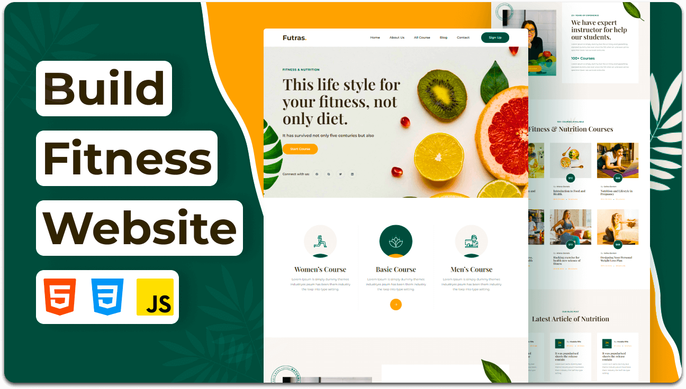

<div align="center">
  
  

  <br />
  <br />

  <h2 align="center">Futras - Fitness Website</h2>

  Futras is a fully responsive fitness website, <br />Responsive for all devices, build using HTML, CSS, and JavaScript.


</div>

<br />

### Demo Screeshots



### Prerequisites

Before you begin, ensure you have met the following requirements:

* [Git](https://git-scm.com/downloads "Download Git") must be installed on your operating system.

### Run Locally

To run **Futras** locally, run this command on your git bash:

Linux and macOS:

```bash

```

Windows:

```bash

```

### Contact
https://github.com/shivamBhavsar-cmd

### License

This project is **free to use** and does not contains any license.
